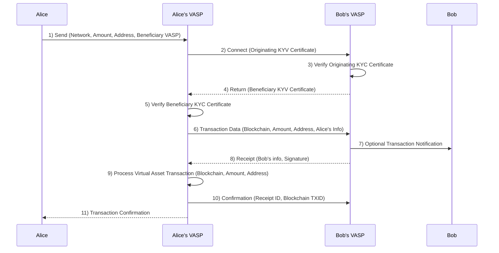

The TRISA protocol enables peer-to-peer exchange of compliance information over a mutually authenticated connection so that the identity of both the sender and the recipient can be verified. The protocol contains methods for unary and streaming information exchanges as well as helper functions for key exchange and address confirmation to facilitate the secure transfer of PII information. The protocol itself is designed to be flexible, adaptable to regulatory changes, the needs of different types of VASPs, and future proofing for tomorrow’s technology.

The goal of a TRISA information transfer is to synchronize compliance information such that both the Originator and the Beneficiary VASPs can cryptographically prove they have identical compliance information for a specific transaction. The sending VASP encrypts and digitally signs the compliance payload along with a timestamp of when the compliance information is sent. The receiving VASP will verify the payload and add the timestamp of receipt, re-encrypting and digitally signing the payload, echoing it back to the sender. At the end of the information transfer, both parties will have an identical payload and digital signature that they will store for the duration of regulatory compliance.

This section describes the transfer protocol at a high level as well as issues and considerations for TRISA implementers joining the network.

## Protocol

The protocol for sending transaction identity information is:

1. Determine how to connect to the Beneficiary VASP using the Global Directory Service.
2. Establish a secure, mutually authenticated TLS connection between the VASPs to assure privacy of data in transit.
3. Originator VASP sends a PII information transfer request to the Beneficiary VASP in a secure envelope with a unique message identifier.
4. Beneficiary VASP verifies counterparty PII information (and may update it as necessary) and returns a signed secure envelope with the receipt timestamp using the same message identifier.
5. Once the Originator VASP has confirmed all required compliance information has been correctly received, Originator VASP posts a transaction to the blockchain.
6. If necessary, Originator VASP updates the transaction payload in the secure envelope with the transaction ID, signs it and sends it to the Beneficiary VASP using the same envelope ID.
7. The Beneficiary VASP updates the receipt timestamp, signs and returns the secure envelope using the same envelope ID.
8. At this point the Originator and Beneficiary VASPs have identical encrypted and digitally signed payloads for a completed transaction on the blockchain; both VASPs should maintain this information on durable long term storage for the compliance period.

Communication between exchanges begins when the originating exchange establishes a TLS connection:



Mutual authentication can be facilitated over the connection protocol as the Originator VASPs (here called “Alice’s VASP” as a real-world example) also provides their identification certificate to the destination exchange (here Bob’s VASP). Once a secure connection is established, the Originating VASP can then initiate the virtual asset transfer to the Beneficiary VASP along with the information required under the Travel Rule. To prove it has received the data, the Destination VASP sends a timestamped and digitally signed receipt that includes the hash of the identity information that was sent. The Originator VASP must keep this information to meet its record-keeping obligations under FATF recommendations.


## Connection Optimization

Because establishing a new SSL/TLS mutually authenticated session between VASPs for every single transaction could prove to be overly costly in computation for key exchange and session establishment, it is acceptable to keep a connection open and exchange data for multiple transactions over a single connection. This is similar to how a browser keeps HTTPS web connections open for accessing multiple web pages in a single connection with a web server.

The v1beta1 implementation of the TRISA protocol uses the [gRPC](https://grpc.io/) library to establish secure communication. gRPC includes a bidirectional streaming mode that allows long running connections with high throughput messaging between nodes. This mode is optional in TRISA but can be used to support batch messaging and increase the performance of TRISA messaging.

## Batch Processing

Many VASPs (primarily exchanges who have large daily transaction volumes) are looking to retrofit Travel Rule compliance onto existing cryptocurrency transaction flows. The idea is to support batch transaction processing at the end of a day of trading and transactions. Batch processing can be done without impacting the Straight Through Processing (STP) of existing VASP data processing and transaction processing pipelines.

For example, some VASPs have optimized blockchain transactions to group 50-200 payments in a single blockchain transaction, which dramatically reduces transaction costs. VASPs can use TRISA to batch the originator and recipient data and not interrupt their existing optimized payment flows. However, there are two issues with this approach that are not solved in this version of the TRISA whitepaper:

- *Funds availability*: According to FinCEN, batch processing is acceptable, but funds received cannot be delivered to the recipient until the corresponding Originator information has been provided and scanned for sanctions and risk compliance. This requirement can delay the availability of inbound cryptocurrency payments to customers for many hours.
- *Transaction finality*: FATF, FinCEN and other guidance and regulation allows VASPs to process private transactions without Travel Rule compliance. VASP-to-VASP transactions, however, must send Originator and Beneficiary information. This requirement raises the problem of how a VASP is to know that an outbound or inbound blockchain transaction is from a private wallet, or from another VASP. In a world of batch processing, there is no current solution for a VASP to determine if a payment inbound or outbound is to or from a private wallet in a deterministic fashion. This limitation argues for real-time address detection. The TRISA community is still researching this issue. Perhaps timeouts (24 hours, for example) will suffice. Otherwise a real-time verification and processing model is preferred, as this solution preserves one of the most valued capacities of cryptocurrencies—near real-time transfer of funds globally with provable receipt of said funds.

## Asynchronous Transfers

When a Beneficiary VASP receives Travel Rule transfer information from the Originating VASP through the TRISA protocol it may not always be able to respond immediately with any needed corrections or fill in for the missing/incorrect Beneficiary information provided. Thus the Beneficiary VASP should be able to respond back, at a later time, with the correct beneficiary information or provide errors if appropriate e.g., the beneficiary address is not owned by the Beneficiary VASP.

The Beneficiary VASP will return a [control flow response]({}) to the transfer message to notify the Originating VASP that they will handle the compliance transfer in an asynchronous manner. The reply is also composed as a secure message with digitally signed timestamps for auditing purposes. Inside of the transaction payload, the Beneficiary VASP will provide additional information about when the Originating VASP can expect a response. The Originating VASP should delay any further action or communication until either the expected time frame expires or they receive a follow-on response from the Beneficiary VASP.

```proto
message Pending {
    string envelope_id = 1;       // TRISA envelope ID
    string received_by = 2;       // recipient or recipient VASP name
    string received_at = 3;       // when request was received (RFC3339)
    string message = 4;           // optional message for counterparty
    string reply_not_after = 5;   // when response will be returned (RFC3339)
    string reply_not_before = 6;  // response will not be sent before (RFC3339)
    string extra_json = 7;        // extra data (JSON-formatted)
    Transaction transaction = 15; // original transaction for reference
}
```

The Originating VASP should be prepared to receive such asynchronous callbacks from the Beneficiary VASP and take appropriate measures to handle it by caching the original message and awaiting a subsequent transfer message from the Beneficiary VASP. All messages that refer to the same blockchain transaction will contain the same envelope ID so that all messages may be linked together. Messages are ordered by the digitally signed timestamps in the payload, so it is important for integrators to ensure they are correctly decrypting payloads and sending correctly modified responses with new timestamps.

Once the Beneficiary VASP has completed their compliance processing, they should initiate a TRISA transfer back to the originating VASP that accepts the original transfer by providing the original or corrected compliance information or rejects it by providing an error in the secure envelope. This will give the Originating VASP conclusive information to take follow on actions like executing the transaction on the chain or handling the error and following the appropriate workflow.