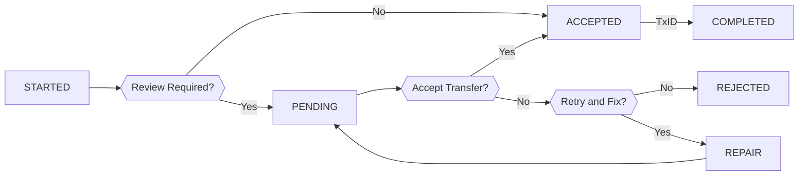
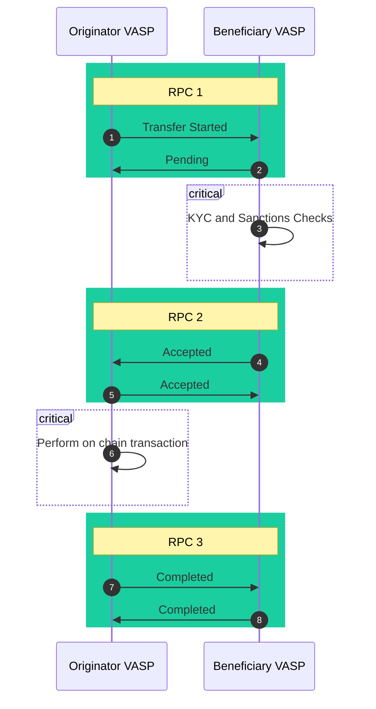
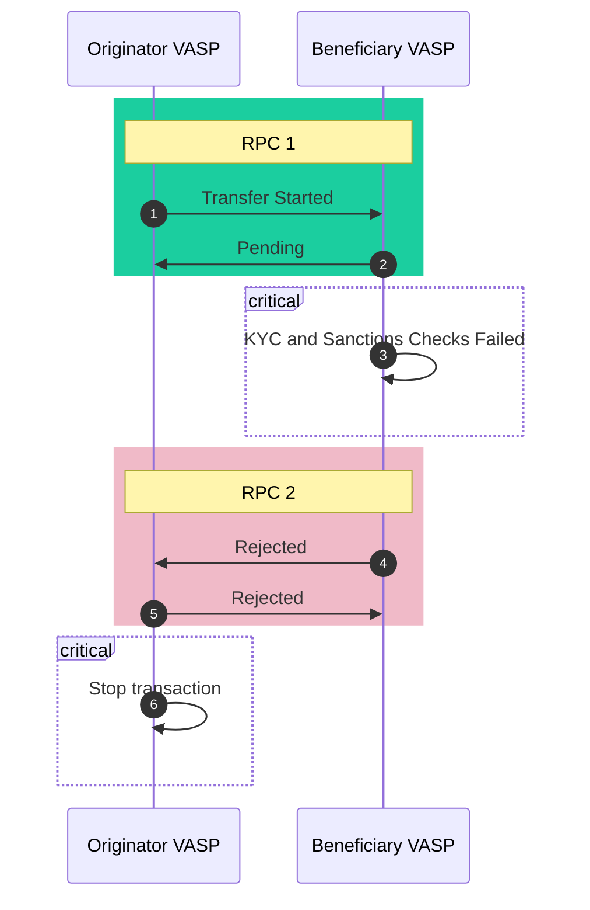
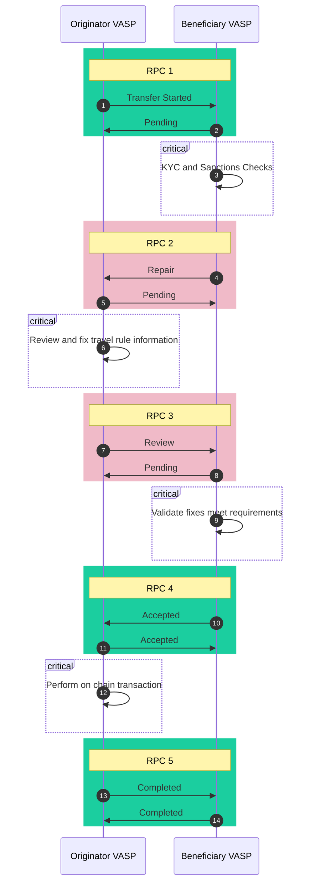

In TRISA v1.1 an optional `transfer_state` field was added to the secure envelope to assist TRISA implementers managing various TRISA data exchange workflows. While completely optional, the `transfer_state` signals to the counterparty (the recipient of the secure envelope) the intent of the current transfer message. The transfer state is an enum, and the available states are described below:

| Code | State | Description |
|---|---|---|
| 0 | UNSPECIFIED | The transfer state is unknown or purposefully not specified (default case) |
| 1 | STARTED | This is the first message in the TRISA workflow |
| 2 | PENDING | Action is required by the sending party, await a following RPC |
| 3 | REVIEW | Action is required by the receiving party (rarely used in transfers, useful for applications) |
| 4 | REPAIR | Some part of the payload of the TRISA exchange requires repair (attached to error envelopes) |
| 5 | ACCEPTED | The TRISA exchange is accepted and the counterparty is awaiting the on-chain transaction |
| 6 | COMPLETED | The TRISA exchange and the on-chain transaction have been completed |
| 7 | REJECTED | The TRISA exchange is rejected and no on-chain transaction should proceed (attached to error envelopes) |

The state transitions are described by the following flow-chart:




## Workflows

While the flow diagram above does a good job explaining how to transition a Transfer between states, it does not describe how those states might be engaged in practice using the `TransferRPC` and different payloads. This section contains sequence diagrams for standard worklows and exchanges.

Keep in mind that **the goal of a TRISA workflow is ensure that both counterparties have the exact same Travel Rule payload**, stored using a cryptographic method that
only they can decrypt.

In practice, this means that an RPC request may be "echoed" as a response -- e.g. you may receive a secure envelope where the only action you have to take to "accept" the request is to send the same payload back to the requester, encrypted using the requester's public keys. This also means that you should not omit travel rule information payloads from each response as the last message contains the payload in the "final state" ready to be stored for the compliance statute of limitations.

### Standard Accept Workflow

The following sequence diagram shows the RPCs needed to perform the simplest and most common Travel Rule information exchange:



1. In **RPC 1**: the originator VASP sends a Secure Envelope with a Travel Rule payload to the beneficiary VASP. FATF recommends that this payload contains a complete IVMS101 payload, including the beneficiary details. The counterparty then returns a pending message with a pending payload to indicate that they need to perform their own KYC and sanctions checks before approving. A pending response is normal in the case of human-in-the-loop decision making, but some VASPs may have the ability to auto-approve transactions.

{}
Some VASPs may be willing to "repair" an IVMS101 payload if the beneficiary details are not provided (e.g. by populating those details in the response). So it may be possible to send an incomplete Travel Rule information exchange request in order to complete the transaction. TRISA is a peer-to-peer network, and VASP behavior will differ based on their jurisdictional responsibilities. When in doubt, we recommend you directly contact the compliance officer at the VASP and establish a mechanism between your entities for ensuring Travel Rule compliance occurs smoothly.
{}

2. After performing KYC sanctions checks and confirming that the transfer may proceed, the beneficiary VASP initiates **RPC 2**, sending an accepted envelope with the travel rule payload; the originator VASP echos this acceptance back.

3. The originator VASP may now apply the transaction to the specified chain. After they have performed the on-chain transaction, they will send a final message to the beneficiary VASP, updating the payload with the transaction details and marking the transfer as completed. The beneficiary VASP will echo the payload back to the originator VASP.

### Reject Transfer Workflow

In the case where the counterparty KYC and sanctions checks have identified a high risk entity, the beneficiary VASP must reject the transfer and indicate that the transfer should not continue by sending a _rejection_ back to the originating VASP.

A rejection is a `SecureEnvelope` that _does not contain a payload_ but rather contains an error code with `retry = false`. For example, the following secure envelope might be sent:

```json
{
    "id": "envelope-id",
    "timestamp": "rfc3339 timestamp",
    "error": {
        "code": "HIGH_RISK",
        "message": "We have identified the indicated beneficiary on a sanctions list.",
        "retry": false
    },
    "sealed": false
}
```

The workflow for rejection is as follows:



Note that the originator VASP should not perform any actions on the blockchain specified after receiving a rejection according to the rules of their jurisdiction. If the beneficary VASP recieves the block chain transaction anyway, they should proceed by quarantining the transaction according to the rules of their jurisdiction. Keep in mind that sending a TRISA rejection message does not prevent any blockchain transactions, it is simply a signal to the counterparty not to proceed.

### Repair Workflow

If not enough information has been provided by the originating VASP or something went wrong handling the travel rule information exchange, the beneficiary VASP may indicate that the originating VASP should try again and fix the specified problems by sending a _repair_ message back to the originating VASP.

A repair is a `SecureEnvelope` that _does not contain a payload_ but rather contains an error code with `retry = true`. For example, the following secure envelope might be sent:

```json
{
    "id": "envelope-id",
    "timestamp": "rfc3339 timestamp",
    "error": {
        "code": "INCOMPLETE_IDENTITY",
        "message": "Our jurisdiction requires the date of birth of the originator.",
        "retry": true
    },
    "sealed": false
}
```

The repair workflow is as follows:



It's possible that multiple repair and review messages might be sent back and forth in order to resolve a transaction. TRISA encourages all VASPs to recognize the limited resources of compliance teams and to work to minimize exchanges as much as possible by providing as much detail about a repair as possible and directly contacting compliance officers for assistance in ensuring the transaction might be repaired effectively.