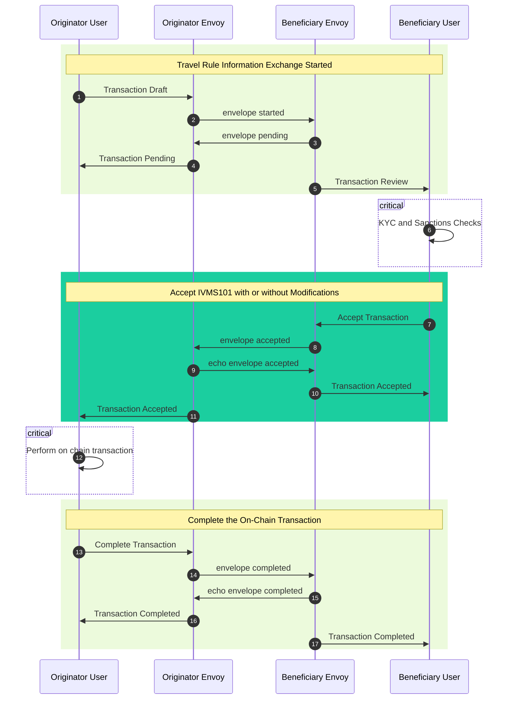
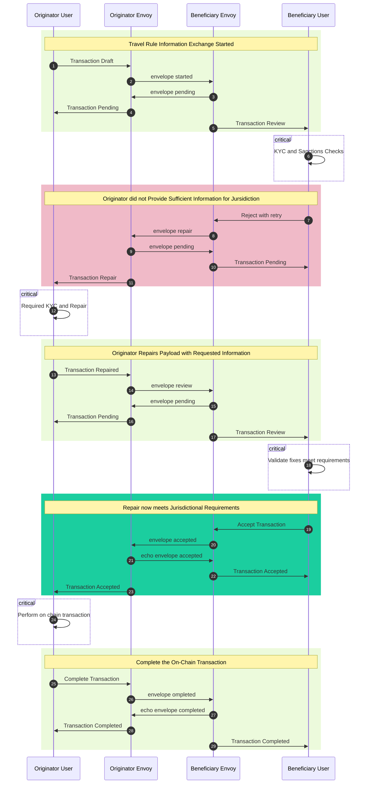
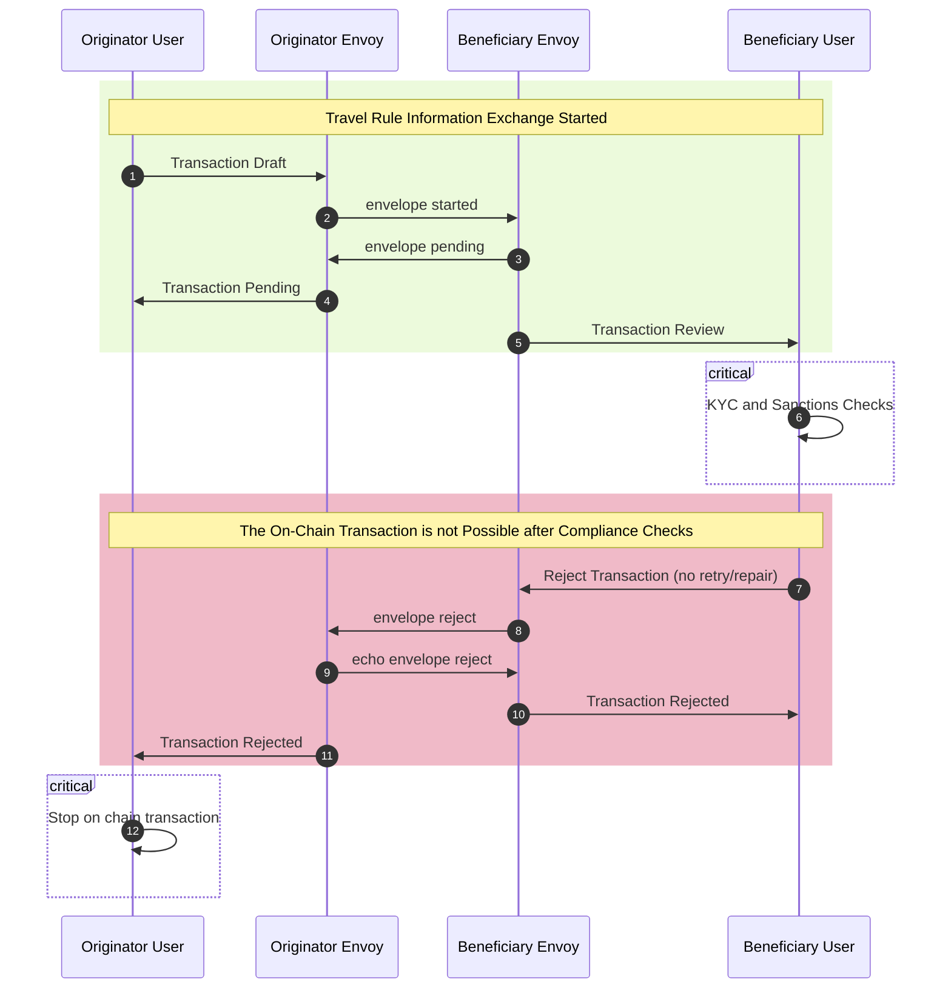

A brief summary of a travel rule compliance exchange with Envoy is as follows:

1. The originating VASP identifies a counterparty either via a Travel Address (TRP) or by using the counterparties list (TRISA).
2. Optionally, an address confirmation message is sent to the counterparty to confirm the counterparty controls the specified wallet address.
3. The originating VASP creates a transaction then sends a secure envelope to the counterparty via TRISA or TRP (or email) so that they can review it.
4. The counterparty VASP reviews the information then accepts it if it meets their compliance requirements or rejects it if it doesn't.
5. If accepted, the originating VASP completes the on-chain transaction, then sends a completion message back to the counterparty with the transaction ID.

There are four basic workflows:

- Accepted and Completed
- Repairs Requested
- Rejected and/or Canceled

## Accepted and Completed

## Repairs Requested

## Transaction Rejected and/or Canceled

## Transaction States and Actions

A transaction may be in one of the following states:

| Status | Description |
|---|---|
| Unspecified | The transfer state is unknown or purposefully not specified (zero value) |
| Draft | The transaction has been created but no secure envelopes have been sent yet |
| Pending | Awaiting a response from the counterparty |
| Review | Requires review by a compliance officer and some action taken |
| Repair | An error has been sent back from the counterparty requesting a change |
| Accepted | The TRISA exchange has been accepted by the counterparty; awaiting the on-chain transaction |
| Completed | The TRISA exchange and the on-chain transaction have been completed |
| Rejected | The TRISA exchange is rejected and no on-chain transaction should proceed |
| Canceled | The TRISA exchange is canceled before it was completed |

When a transaction is in one of the following states, a compliance officer or auto review policy must take one of the following actions:

- **Draft**: Start an information exchange by _sending_ a secure envelope to the counterparty. This will cause the transaction to move to the Pending state.
- **Pending**: When awaiting a response from the counterparty, the only action that can be taken is to _cancel_ the information exchange, sending a Rejection envelope with the CANCELED code to the reviewing counterparty.
- **Review**: Either _accept_ or _reject_ the transaction, triggering a message to be sent to the counterparty with the decision. If the transaction is accpeted it will move to the Accepted state; if the rejection reqires a repair (retry) then it moves into the Pending state, otherwise it moves into the Rejected state.
- **Repair**: _Repair_ the issue and send a new secure envelope to the counterparty so that they can either accept or reject it. Alternatively if the requested information is not available, _reject_ the requested changes.
- **Accepted**: _Complete_ the transaction by sending the on-chain transaction ID to the counterparty so they can identify the transaction record.
- **Completed**: At this point the transaction is complete, so you can _archive_ the transaction to long term storage without viewing it in the dashboard or API calls.
- **Rejected**: The transaction is also complete in a rejected state, so you can _archive_ the transaction to long term storage.
- **Canceled**: Similar to Completed and Rejected, this is a final state, so the only action you might have is to _archive_ the transaction to long term storage.

A summary of the actions that can be taken are below:

| Action | In Status(es) | Description |
|---|---|---|
| Send | Draft | Send a TRISA exchange message to the counterparty initiating the travel rule Transfer. |
| Accept | Review | Accept the state of the TRISA exchange as having enough required compliance information for the on-chain transaction to continue. |
| Reject | Review, Repair | Require the counterparty to include more information for the TRISA exchange or stop the on-chain transaction. |
| Repair | Repair | Fix any deficiencies required by the counterparty and send a new message for review. |
| Complete | Accepted | Once accepted, send the on-chain transaction ID and transaction details to the counterparty. |
| Archive | Completed | Archive the completed transaction for the specified compliance period. |
| Cancel | Pending | Send a message to the counterparty stopping the review process. Technically this can be sent at any time, but is most relevant when waiting for review. |